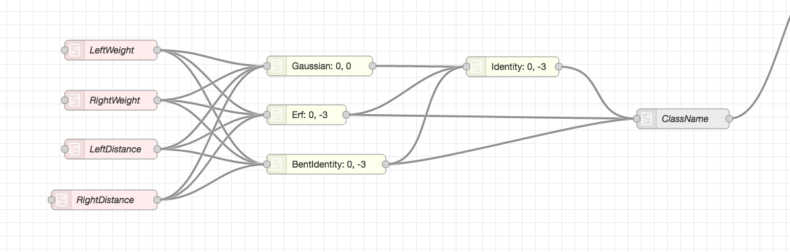

## Artificial Neural Network Builder

Node-RED Nodes for creating [Artificial Neural Networks](https://en.wikipedia.org/wiki/Artificial_neural_network) (ANNs) in [Node-Red](https://nodered.org). 

Artificial Intelligence (AI) is (at time of writing) all the rage, but many outside the AI community do not have a mental image of the underlying technology driving the AI revolution.

ANNs are the basis for AI technology. ANNs are structures based on our ideas of how our brains work: interconnected neurons that "fire" when a certain threshold is reached. This firing is passed along a neurons connections to other neurons that fire accordingly, i.e., when a threshold is reached.

ANNs have three distinct neuron types: input, hidden and output. The input nodes pass (both training and testing) data into the ANN, the hidden nodes have connections and weights and represent the working core of an ANN. The output nodes simply passes the final output of the hidden nodes computation out of the network. 

Todays ANNs are extremely complex and contain millions of neurons and billions of connections between them. The purpose of this package is not aimed at creating an ANN that would compete with ChatGPT.

## Purpose

Three main purposes for this project:

1. I wanted to gain a better understanding on how to create my own Node-RED nodes and what is possible,
2. I wanted to gain a better understanding of the server-frontend communication possibilities, and
3. I wanted to provide a demonstration of how ANNs work and how they are constructed.

Of those, the first two have been fulfilled with the third being fulfilled in the sense that one can get a feel for how ANNs are constructed and trained but one does not get a working ANN.

The reason that ANN does not train is because the back propagation algorithm is broken. This breakage is a known-unknown since the triggering of the back propagation is not done as it is normally done.

Back propagation normally takes the entire ANN into consideration and does one pass over the complete ANN, making weight changes accordingly. This ANN builder does not do that, instead it "propagates" the changes in weights back through the ANN via the connections between nodes, i.e., going backwards along the existing connections. This means that changes to weights are done multiple times as the difference in output nodes errors are propagated back through the ANN.

Therefore take this software as a good way to demonstrate the principles of how ANNs work, however **do not rely** on it to do anything else that might be useful. In that sense, this art not science.

## Basic workings of ANNs

This is a very rough and simplified description of the authors understanding of how ANNs work. **No guarantee of accuracy is made**.

The above is a very simple ANN found in the [balances and scale](examples/bands.json) flow. The pink nodes are the input nodes,  the yellow the hidden nodes and the grey is the output node. The neuron connections are normal Node-RED connections between nodes.

Each hidden node has an activation function (that it's name in the image) which supplies a function to generate the nodes output. Each hidden node takes all its connections, computes a total value based on the value generated by the linked node multiplied by the weight on the connection between the two nodes. The node than adds a bias value (the first number after the name) to the computed value and then passes that value to the activation function. The result is compared to a threshold (the second number of the node name) and if the value is larger than the threshold, the node (aka neuron) "fires", i.e. is active.

The value is passed to all nodes connected to it and each node than uses that value to compute it's own value. This is repeated for each layer defined in the network, until the output layer is reached and output values are generated.

What is not shown are the weights on each connection. These weights are adjusted during the back-propagation step. To view the weights, double click on and hidden or output node and the weights are shown in the properties window of the node.

Back propagation is the correction of connection weights based on the difference between desired output and actual output. This error is propagated *backwards* through the ANN from the output nodes to the input nodes. Along the way, the weights on each relevant connection is adjusted. "Relevant connection" because connections between nodes that did not fire are not adjusted. 

This is repeated for the entire training data. Normally ANNs are trained using training data, with which the weights on connections are adjusted until the output nodes produce the desired outputs - as defined in the training data.

## Known Unknowns

- No internationalisation 
- No localisation
- Non-working back-propagation algorithm
- No extensive documentation other than this readme
- Spaghetti code with no tests

## Unknown Knowns

- None.

## Usage

Each network is assumed to be created in a separate Node-RED flow tab. Each network should have exactly one Trainer node and one Backprop node.

The ANN itself can have as many input, hidden and output nodes as required. There is a special interconnectedness between the trainer node and the input nodes, as there is a special interrelatedness with output nodes and the backprop node.

## Prior Art

- Backpropagation algorithm inspired by:
https://mattmazur.com/2015/03/17/a-step-by-step-backpropagation-example/

- Activation functions where taken from https://github.com/howion/activation-functions

- Datasets come from https://archive.ics.uci.edu/ml/datasets.php